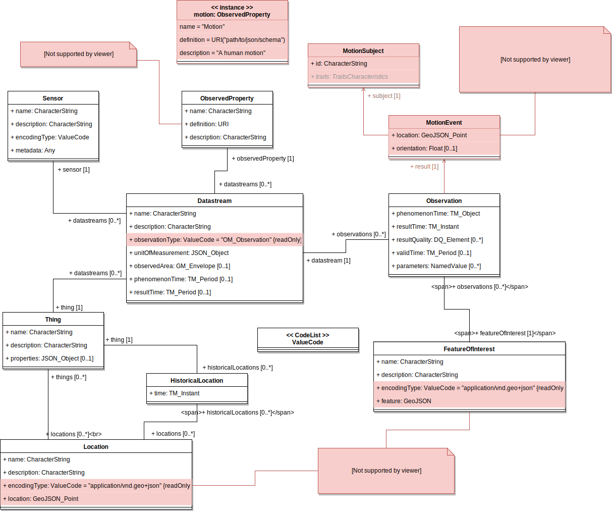

# FUI StoreConnect's Sensors API

This repository contains the sources and documentation of the FUI [StoreConnect](https://www.pole-scs.org/projet/storeconnect) project's Sensors API part.

## Authors

[Aurélien Bourdon](https://github.com/abourdon), [Romain Rouvoy](http://romain.rouvoy.fr), [Lionel Seinturier](http://www.lifl.fr/~seinturi).

## Directory layout

This directory is organized as follows:

Directory                                   | Description
------------------------------------------- | --------------------------------------------------------
[docker](./docker)                          | Docker files of the FUI StoreConnect's Sensors API
[third-parties](./third-parties)            | Third parties used by the FUI StoreConnect's Sensors API 

## Prerequisites

- The FUI StoreConnect's Sensors API specification follows the [OGC SensorThings API specification](https://github.com/opengeospatial/sensorthings);
- The FUI StoreConnect's Sensors API specification uses the [GeoJSON format](http://geojson.org/) to encode geographic data;
- The FUI StoreConnect's Sensors API implementation is based on the [FraunhoferIOSB's GOC SensorThings implementation server](https://github.com/FraunhoferIOSB/SensorThingsServer). 

## The StoreConnect's Sensor API data model

The StoreConnect’s Sensor API data model extends the [OGC SensorThings API data model](http://docs.opengeospatial.org/is/15-078r6/15-078r6.html#24) as expressed by the following picture (in **white** the original OGC SensorThings API data model, in **red** the extension brought by the StoreConnect's Sensor API specification).



_NB: this diagram has been generated via [Draw.io](https//www.draw.io). Any modification can be applied by importing its associated [raw file](resources/storeconnect-sensor-api-data-model.xml)._

The following section defines all extensions brought by the StoreConnect's Sensor API to the OGC SensorThings API data model. Before to read next, be sure to correctly understand the [OGC SensorThings API data model](http://docs.opengeospatial.org/is/15-078r6/15-078r6.html#24).

### `FeatureOfInterest`

The main StoreConnect preoccupation is the ability to observe _phenomenons_ within a given store. From the StoreConnect point of view, any `FeatureOfInterest` is then the store or, even better, _parts_ of the observed store. These _parts_ (or the store himself), are defined as a [GeoJSON](http://geojson.org/) value represented by the `FeatureOfInterest#feature` attribute to fit with OGC SensorThings API specification. This way, any `FeatureOfInterest` must contain an `encodingType` set as `application/vnd.geo+json`.

Following what we want to observe (the store himself or parts of the store), the associated GeoJSON would be a [GeoJSON Point](https://tools.ietf.org/html/rfc7946#section-3.1.2) (in case of observing the whole store) or a [GeoJSON Polygon](https://tools.ietf.org/html/rfc7946#section-3.1.6) (in case of observing parts of the store).

In addition a `FeatureOfInterest#feature` MAY define the venue (or place) from which the associated GeoJSON coordinates (Point or Polygon) are related. To do that, this venue MUST:
- Be declared as a [GeoJSON property](https://tools.ietf.org/html/rfc7946#section-3.2)
- Named `venueId`
- Have an integer value that point to the identifier of the venue that make sense in your external system

### `Location`

A StoreConnect Sensor API's `Location` represents the location of a given `Thing`.
This way:
- the `Location#location` attribute is a [GeoJSON Point](https://tools.ietf.org/html/rfc7946#section-3.1.2) representing the coordinates of this location
- the `Location#encodingType` is always set as `application/vnd.geo+json` to fit with OGC SensorThings API specification

In addition a `Location#location` MAY define the venue (or place) from which the associated GeoJSON coordinates are related. To do that, this venue MUST:
- Be declared as a [GeoJSON property](https://tools.ietf.org/html/rfc7946#section-3.2)
- Named `venueId`
- Have an integer value that point to the identifier of the venue that make sense in your external system

### `ObservedProperty`

In the OGC SensorThings API data model, the `ObservedProperty` is a `FeatureOfInterest` property which can be observed.

From the StoreConnect Sensor API point of view, these properties can be:
- A human _motion_
- A _contextual_ value (e.g. weather)

Hence, the StoreConnect Sensor API defines the following `ObservedProperty` instances:
- A `motion`, that represents a human motion
- A set of contextual values, as the `weather` (not shown in the diagram)
 
Each of these `ObservedProperty` instances defines the associated `result` type of an `Observation`. In addition, the associated `ObservedProperty#definition` URI must point to an existing [JSON Schema](http://json-schema.org/) that describes the `Observation#result`  type structure.

Hence, for each `Observation#result` type, there is an associated `ObservedProperty` instance (`motion` for `MotionEvent`, `weather` for `WeatherEvent`...).

_NB: Only the `ObservedProperty`'s `motion`  instance is shown in the diagram._

### `Datastream`

A StoreConnect Sensor API's `Datastream` is always encoded as the complex `OM_Observation` `observationType`. 

To know what is the concrete type used by associated `Observation`, you must refer to the associated `ObservedProperty`.
 
### `Observation`

As explained previously, any StoreConnect Sensor API's `Observation#result`  type is defined by the associated `ObservedProperty`.

The diagram only represents the `MotionEvent` type (but keep in mind there would be more `Observation#result` types, as the `WeatherEvent` for instance). A `MotionEvent` is described below.

#### `MotionEvent`

In the same way as the [StoreConnect's main ontology](https://github.com/StoreConnect/storeconnect-ontologies-api/tree/develop/ontologies/storeconnect-main), a `MotionEvent` (or `sc:MotionEvent` in the StoreConnect's main ontology) represents a human _motion_ caught by a StoreConnect's `Sensor`.

A `MotionEvent` is composed of the following attributes and relations:

Name            | Type              | Description
--------------- | ----------------- | ------------------------------------------------------------------------------------------------------------------------------------------------------------------------------------------------------------------
`location`      | `GeoJSON Point`   | The dynamic location within the `FeatureOfInterest#feature`. Represented by a [GeoJSON Point](https://tools.ietf.org/html/rfc7946#section-3.1.2) by adding the `floor` and the `building` as additional parameters
`orientation`   | `Float`           | (Optional) Orientation of the perceived phenomenon
`subject`       | `MotionSubject`   | The associated subject (or target) to this `MotionEvent`

#### `MotionSubject`

As for the `sc:MotionSubject` in the StoreConnect's main ontology, a `MotionSubject` describes identification information about the perceived phenomenon. It consists of two parts:
- An identifier
- Some physical or behavioural trait characteristics

**An identifier is always relative to the associated `Sensor` from which the `Observation` has been made.**

_NB: For the moment, there is no existing physical or behavioural trait characteristics (coming in a future StoreConnect's Sensor API version). This value can so be omitted, and then, a `MotionSubject` is, for the moment, only pointing to a given identifier._ 

## How to...

### ... insert a sensor's observation into the StoreConnect's Sensor API?

**To be described**

### ... access to the official FUI StoreConnect's Sensors API instances?

The table bellow lists the set of FUI StoreConnect's Sensors API instances and their associated access links.

Instance name   | Description                           | Access link
--------------- | ------------------------------------- | ---------------------
integration     | Integration deployment environment    | https://goo.gl/i3gGBQ

### ... clone sources?

This project uses [Git submodules](https://git-scm.com/book/en/v2/Git-Tools-Submodules), then beware to clone this project by using the `--recurse-submodules` option:

```bash
    git clone --recurse-submodules https://github.com/StoreConnect/storeconnect-sensors-api.git
```

## Additional note

For the moment, there is no additional check for incoming data. Indeed, the StoreConnect Sensor API implementation is a copy of the FraunhoferIOSB's GOC SensorThings implementation. Thus, there is no type control over extended types brought by the StoreConnect Sensor API model.
Hence, we suppose that StoreConnect Sensor API clients respect the StoreConnect Sensor API's data model.

## How to contribute

Wants to contribute? Feel free to make a `pull request` following the [contributing](./CONTRIBUTING.md) instructions.